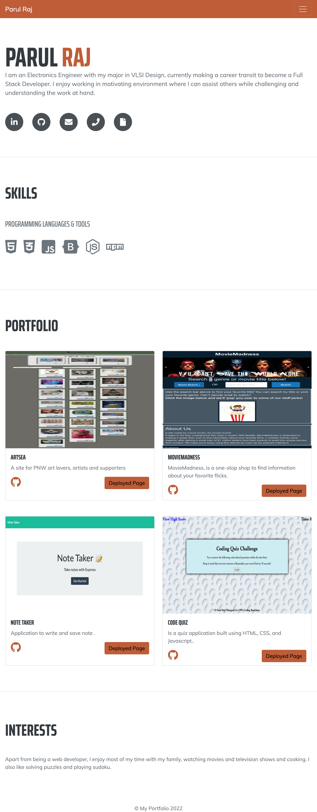

# Portfolio

## Description
A work portfolio is a collection of work samples that shows your capabilities to prospective employers.

Advantages of Portfolio:
1. Provides tangible evidence to potential employers of your accomplishments, skills, and abilities. 
2. It shows the scope and quality of your experience and training.

### Motivation
* To showcase your work to potential employers or potential clients.

### Why do we need Protfolio?
* Portfolios demonstrate the competencies you would list on a resume. 
* It showcases your work to potential employers during job hunt. 
* It presents evidence of your relevant skills and abilities. 
* Portfolios are also helpful for independent contractors, consultants, or business owners who need to provide work samples to potential clients.

### Problems Solved
* Portfolio has the developer's name, a recent photo or avatar, and links to sections about me, work, and contact me.
* The links in the navigation bar scrolls to the corresponding section.
* The developer's first application's image is larger in size than the others.
* The images of the applications are linked to the deployed application.
* Responsive layout that adapts to different devices.
* Consolidating CSS Selectors and properties to follow  structure of the HTML elements.
* Made HTML elements follow a logical structure independent of styling and positioning.
* Added accessible alt attributes to images.
* Made a sequential order for heading attributes.
* Ensured all links functioning correctly.

### Tools & Technologies used
1. Visual Studio Code
2. GitHub
3. HTML
4. CSS
5. Git

## Links
* Github source code: https://github.com/sinka27/Portfolio_V-3
* Github deployed page: 
## Screenshot

## Credits
1. Parul Raj
2. Joe Rehfuss
3. Louis Coleman
4. Brett Belka